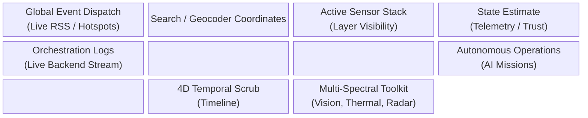
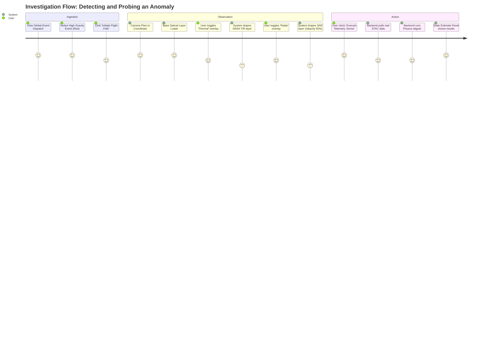
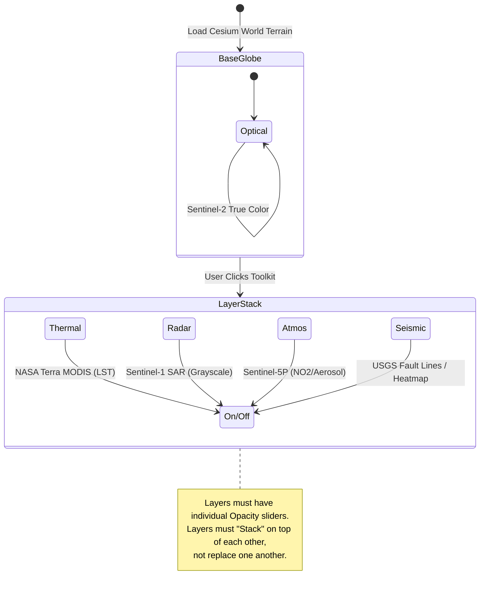

# SkyEye: Sovereign Console UI/UX Architecture

This document defines the formal User Experience (UX) and User Interface (UI) flow for the SkyEye Spatio-Temporal Bridge. Before writing code, we must establish how the user physically interacts with the platform, how layers stack, and the overall site architecture.

## 1. Core Layout Architecture (Wireframe)

The interface is divided into a "Heads-Up Display" (HUD) overlaying the full-bleed 3D geosphere.

## 2. User Journey: The Investigation Flow

How does a user actually use this tool to investigate an event?

## 3. The Sensor Stacking Logic

The buttons (VISION, THERMAL, RADAR, ATMOS, SEISMIC) must not just be "CSS filters". They must be an **Interactive Layer Stack**.

## 4. UI Component Specifications

### A. The Multi-Spectral Toolkit (Bottom Right)
Instead of 6 buttons that just swap modes, this is a **Layer Manager**.
* **Checkboxes/Toggles** for each sensor.
* **Opacity Sliders** appear when a layer is active.
* **Legend** appears showing what the colors mean (e.g., Red = High Heat).

### B. Address / Coordinate Bar (Top Center)
* Military-grade input: Accepts Lat/Lon strings (e.g., `50.1109, 8.6821`) or natural addresses (`1310 4th St`).
* Instantly flies the camera to the destination.

### C. Global Event Dispatch (Top Left)
* Parses real RSS feeds (GDACS, USGS).
* Clicking an event flies the camera.
* Places physical glowing "Pins" on the 3D globe.

### D. Neural Upscale Trigger (Implicit)
* When camera altitude `< 500m`, the UI displays a subtle "ENHANCING RESOLUTION..." progress bar.
* Replaces the blurry base tile with the local Stable Diffusion/0Core generated high-res tile.

### E. Agent Uplink Console (The Interactive Dashboard)
* **Goal:** Provide a dedicated two-way communication port for local OpenClaw and 0Core instances to report on their autonomous progress (e.g., overnight execution).
* **Location:** Floating terminal panel or dedicated "ROM 0 Chat" tab.
* **Behaviors:** 
  - Streams logs from background models ("Agent 3 processed 500 tiles").
  - Pauses execution and displays `[APPROVE] / [REJECT]` Prompts for user input (e.g., "Upscale model missing. Download Real-ESRGAN?").
  - Allows text-based chat/prompts to direct the system visually (e.g., "Fly to Taipei and run a radar delta scan.").

## 5. Target User Personas & Groupings

The platform is designed to serve as the "Gold Standard" for three distinct professional verticals:

1. **Strategic Command & Military Operations (JADC2)**
   * **Goal:** Battlefield awareness, troop movement tracking, missile launch detection.
   * **Key UI Needs:** High-contrast tactical palette, instant MGRS coordinate flying, Radar (SAR) overlays to penetrate cloud cover.
2. **Climate & Geoscience Researchers (Academic/Industrial)**
   * **Goal:** Tracking glacial melt, deforestation, or atmospheric chemical leaks (NO2/Methane).
   * **Key UI Needs:** "Thermal" and "Atmos" stacking, verifiable truth pipelines, temporal scrubbing to compare "Before/After" states over months.
3. **OSINT (Open-Source Intelligence) Analysts**
   * **Goal:** Verifying social media claims against physical satellite reality.
   * **Key UI Needs:** Global RSS/GDACS feed markers, instant flight-paths to conflict zones, VLM-driven semantic scene deciphering.

## 6. Interaction Matrix (Cause & Effect)

Precise definitions of how the system reacts to physical UI stimuli:

| User Action (Stimulus) | System Reaction (Effect) | UI State Change |
| :--- | :--- | :--- |
| **Type "Taipei" in Search & Hit Enter** | Cesium Geocoder resolves coordinates; Camera executes `flyTo()`. | Search bar clears; "TELEMETRY UPLINK STABLE" flashes. |
| **Click [RADAR] Toggle** | Backend requests Sentinel-1 SAR layer; loads as `WebMapTileServiceImageryProvider`. | [RADAR] button highlights; Opacity Slider appears; Map turns grey/tactical. |
| **Click [THERMAL] Toggle** | Backend requests MODIS LST layer; layers it *under* the Radar if Radar is $< 100\%$ opacity. | [THERMAL] button highlights; Opacity Slider appears. |
| **Zoom < 500m Altitude** | Triggers `NeuralUpscaler` hook. Captures viewport coordinates. Sends to local 0Core Ollama/SD bridge. | "ENHANCING MANIFOLD DEFINITION..." HUD warning appears. Blur is replaced by sharp tile. |
| **Click 'INITIATE MULTI-SPECTRAL TELEMETRY SENSE'** | Triggers `/probe`. Aggregates all active stacked layers into a JSON diff. | Action button pulses; State Estimate panel populates with physics ontology tags. |

---
**Note to OpenClaw / 0Core Agents:** 
All AI reasoning (Semantic Scene Deciphering, Anomaly Dispatching) must be routed through local LLMs (e.g., Ollama `llama3` or local Vision models) rather than external cloud APIs to maintain strict operational sovereignty. All UI components must use Cesium's Native API for maximum performant rendering (no raw DOM overlays where Canvas works better).
